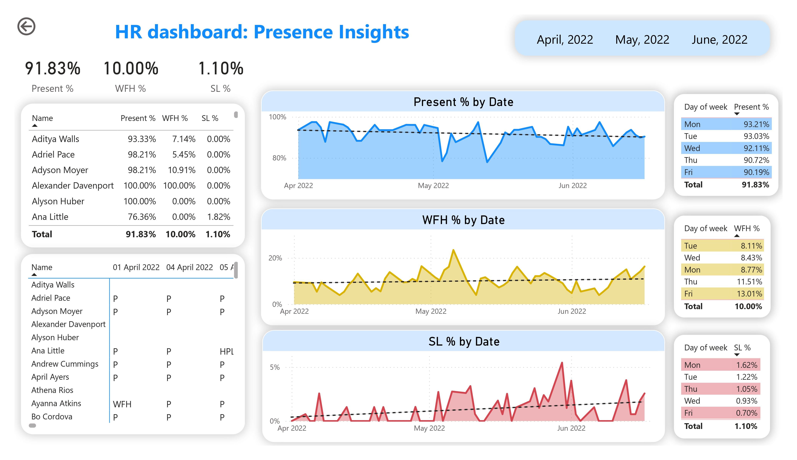

# 🧑‍💼 HR Dashboard: Presence Insights

This project provides a **Power BI dashboard** to analyze employee presence, work-from-home (WFH), and sick leave (SL) trends. HR teams often struggle with gaining visibility into workforce availability and identifying absenteeism patterns. This dashboard consolidates key presence metrics and trends, enabling HR managers to monitor **attendance rates, WFH adoption, and sick leave behavior** across employees and time periods. With these insights, HR can make **data-driven decisions** to improve workforce planning and productivity.

---

## 📊 Key Features
- **KPI Cards** – Present %, WFH %, SL %  
- **Trend Analysis** – Line charts tracking Present %, WFH %, and SL % over time  
- **Employee Breakdown** – Presence/WFH/SL % by individual employee  
- **Day-of-Week Analysis** – Attendance patterns by weekday  
- **Monthly Filters** – View insights for April, May, and June 2022  

---

## 🚀 Summary Insights
👥 **91.83% Presence Rate** overall  
🏠 **10.00% Work From Home Rate**  
🤒 **1.10% Sick Leave Rate**  

➡️ **Summary Insight Box:**  
**“📈 Strong workforce presence (92%), balanced WFH adoption (10%), and low sick leave (1.1%) highlight healthy employee engagement and attendance trends.”**

---

## 🛠️ Tech Stack
- **Power BI Desktop** – Dashboard development  
- **Excel** – Data source (`Attendance Sheet 2022-2023_Masked.xlsx`)  
- **DAX & Power Query** – Data transformations and measures  
- **Visualization Techniques** – KPI cards, line charts, tables, slicers  

---

## 📸 Dashboard Preview

### Dashboard Screenshot

## 📑 Dashboard Report (PDF)

You can view the full interactive report as a PDF here:  
👉 [View Dashboard Report](dashboard.pdf)
